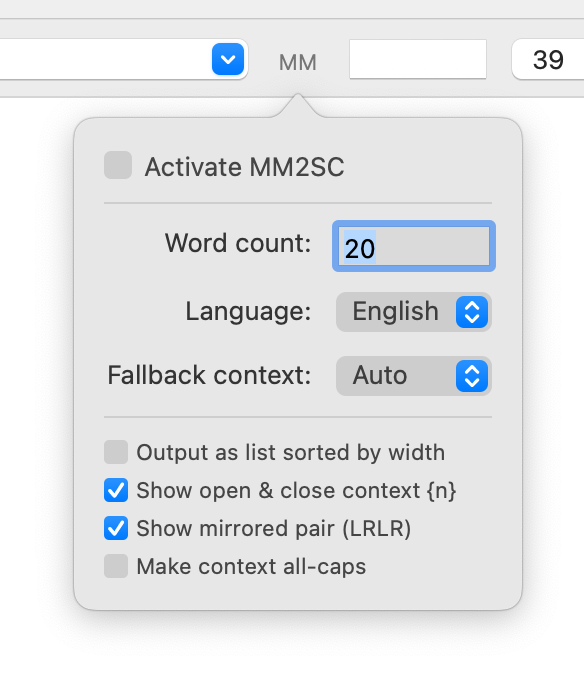

# MetricsMachine 2 Space Center

This extension generates a list of words in RoboFont’s Space Center based on the current pair you’re kerning in the [MetricsMachine](https://extensionstore.robofont.com/extensions/metricsMachine/) extension by Tal Leming.

The wonderful [word-o-mat] extension by Nina Stössinger was a major influence, and this would most certainly not exist if Nina’s word-o-mat hadn’t come first. And thanks to Stephen Nixon for asking about something like this, which encouraged me to share this. I would love to see this extension evolve to have nice menus and an interface as powerful as word-o-mat someday.

Pull requests are greatly appreciated. 🙏

---

### Update 2023.04.30
#### By [@ryanbugden](https://github.com/ryanbugden)

##### UI revamp:

* implement UI as a button in SC with a popover pref window 
* removed status bar. it was unnecessary, because the prefs are no longer always visible, and the status is spelled out in Space Center itself
* rebuilt the UI with [ezui](https://typesupply.github.io/ezui/overview.html)

##### Code rewrite:

* refactored most of the code, for performance, readability, extensibility

##### New features:

* remember user’s settings automatically
* apply Space Center’s Show Kerning upon use

##### Future considerations:

* observer activates when the Space Center opens. checking the on-off checkbox doesn't toggle the observer itself, so it may be a bit expensive... ideally there will be MetricsMachine support via [Subscriber](https://robofont.com/documentation/reference/api/mojo/mojo-subscriber/?highlight=mojo.subscriber). all said, it doesn’t feel slower than before.
* other thoughts are either commented in the code, or filed as [issues](https://github.com/cjdunn/MM2SpaceCenter/issues).

### Update 2022.03.17
* added options for if no pair if found: Auto, UC, LC, Figs, Frac  
* made word count field wider  
* added support for suffixed glyphs and "any language" option (thanks [@weiweihuanghuang](https://github.com/weiweihuanghuang) and [@arrowtype](https://github.com/arrowtype))  
* updated structure of UI (thanks [@ryanbugden](https://github.com/ryanbugden))  
* added truncation for longer (unencoded) glyph names  
* bugfix for mirrored pairs (thanks [@arrowtype](https://github.com/arrowtype))    

### Update 2020.06.30
Thanks to [@arrowtype](https://github.com/arrowtype) there are now options to:

* Show open+closed context
* Show mirrored pair 

[Metrics Machine]: https://extensionstore.robofont.com/extensions/metricsMachine/
[word-o-mat]: https://github.com/ninastoessinger/word-o-mat
